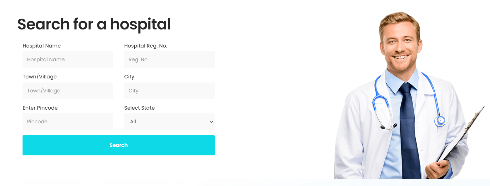
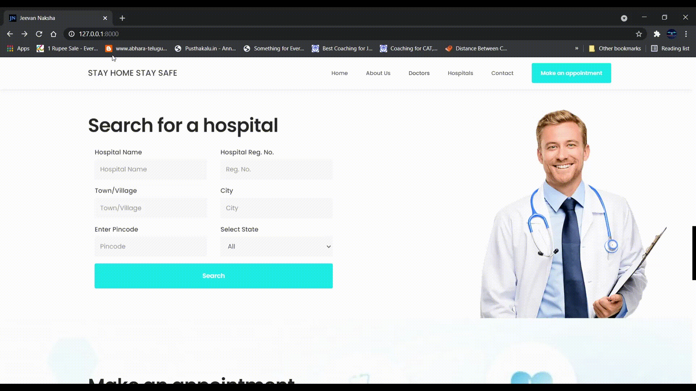
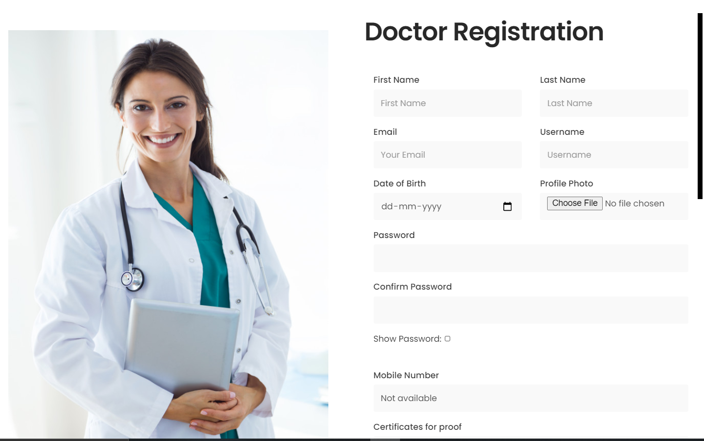
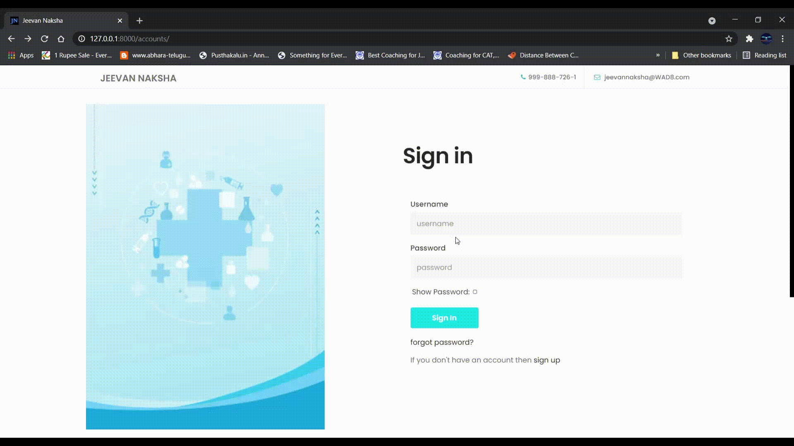
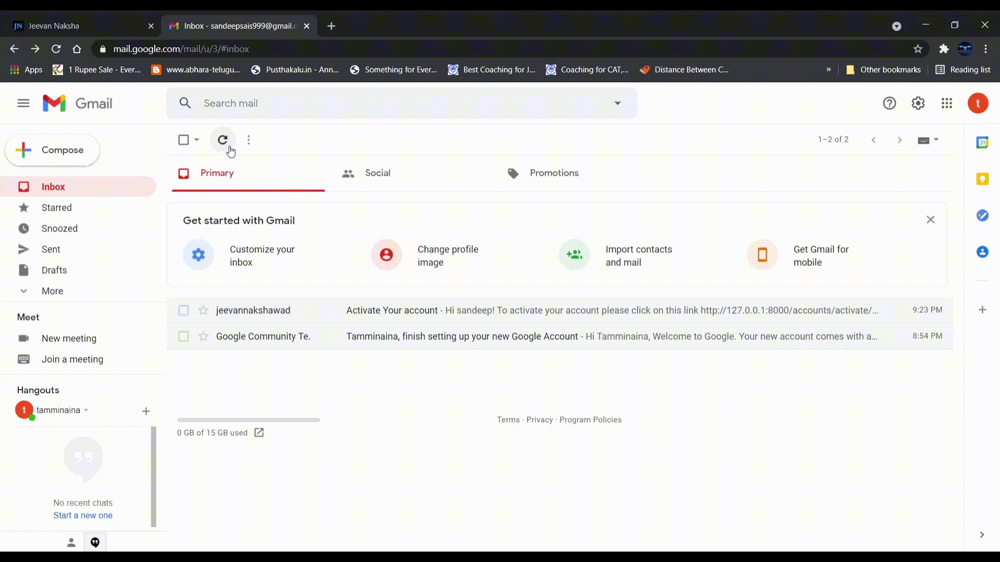

# HOSPITAL SEARCH BAR

This feature helps the user to search for hospital using some filters.
The filters availble to search are:-
- Hospital name
- Hospital registration number
- Town/vilage for area
- City
- Pincode
- State

## Search results
After pressing the search button, you will be directed to the search results page.
In this page you can see the cards of the hospitals based on filters applied. The information given on cards is as follows:-
- Profile photo of hospital to the left most
- Ratigs to the rightmost
- Location
- Pincode
- Chief medical officer
- Phone number
- Email

## You can also view the hospital prifile by clicking 'view profile' button

##########################################################################

# DOCTOR REGISTRATION

Below are the steps for registering as a Doctor:

* From Main page, go to SignIn page.

* For Registering as a new Doctor click SignUp button situated below forgot password option.

* In signup page, click Signup as a Doctor.

* After clicking SignUp as a Doctor, you will get a Registration form as shown below.

* In Doctor Registration Form, Fill all the details asked in the form and make sure the requirements are fulfilled like in Password it should contain a Capital letter, a small letter and some special characters and a minimum length of 8 charecters.

* After filling all details required in the form click on Register Button.

* After registering successfully, you will redirect to the main page with a message showing *Activate your account after clicking the link sent to your mail*.

* Now, go to your registered mail and you can find a mail from *jeevannakshawad* with a activation link for your account.

* Click on that link, now you are succesfully registered as a Doctor and you will be redirected to the main page with the message *Account Activated Succesfully*.

#### *Now you're succesfully registered as a User.*

### *Below are the some of errors you can encounter when you register*
* If Password and Confirm Password are not same it will show *Passwords dont match* error. So make sure you enter the both passwords correctly.
* If any user registered with the same username before you register, it shows *UserName Already Exists*. So, Try with a different username.
* If any user registered with the same email before you register or if you're registering 2nd time with the same email, it shows *Email already Exists* error. So, make sure you enter your email correctly.

